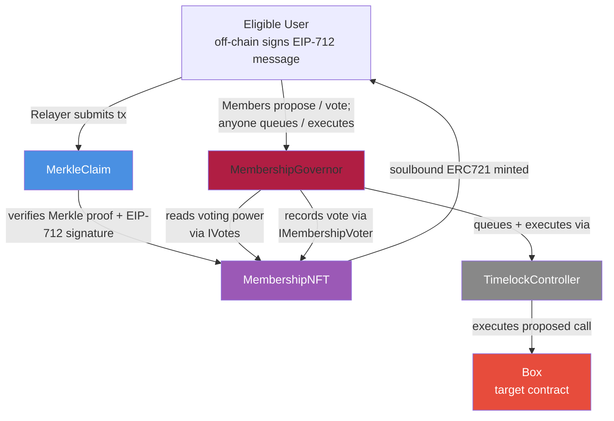

# NFT-Gated Membership DAO

A complete on-chain DAO featuring Merkle-verified airdrop claims, soulbound governance NFTs, custom voting power, dynamic on-chain SVG metadata, and full Governor/Timelock execution.

Built with **Foundry** and **OpenZeppelin v5**.

*For detailed architecture, accounting models, invariants, and threat analysis, see [DESIGN.md](./DESIGN.md).*

---

# Live on Sepolia Testnet

The full DAO lifecycle has been successfully deployed and verified on the Sepolia testnet.

| Contract           | Address                                      | Etherscan                                                                               |
| ------------------ | -------------------------------------------- | --------------------------------------------------------------------------------------- |
| TimelockController | `0x04B1C8c6933a9C677cEA96C8F5D91fC3188D5dc9` | [View](https://sepolia.etherscan.io/address/0x04B1C8c6933a9C677cEA96C8F5D91fC3188D5dc9) |
| MembershipNFT      | `0xd6395238A4c81547287b333844dA96b26Ff95D27` | [View](https://sepolia.etherscan.io/address/0xd6395238A4c81547287b333844dA96b26Ff95D27) |
| MerkleClaim        | `0xBee2F7dc87A55BEebb30d1725604d4a33Ffb310a` | [View](https://sepolia.etherscan.io/address/0xBee2F7dc87A55BEebb30d1725604d4a33Ffb310a) |
| MembershipGovernor | `0xBd6c46d60dFB622974319b1E21088101d1fb58Cf` | [View](https://sepolia.etherscan.io/address/0xBd6c46d60dFB622974319b1E21088101d1fb58Cf) |
| Box (Target)       | `0xaFB14068D20461E2bA37AD3dEbcd007810b62735` | [View](https://sepolia.etherscan.io/address/0xaFB14068D20461E2bA37AD3dEbcd007810b62735) |

### Successful On-Chain Claim

[View Transaction](https://sepolia.etherscan.io/tx/0xc78fdf33aed9cc57e052c3d1f36137bb46c8b226b10a1b972b38e7720d67d176) — Executed a gasless relay claim utilizing an off-chain EIP-712 signature and Merkle proof validation.

---

# Architecture

The protocol is split across five primary contracts to enforce the **Principle of Least Privilege** and maintain strict separation of concerns between distribution, identity, and governance.



---

# Key Design Decisions

## One-NFT-Per-Address Enforcement

Each address can hold at most one Membership NFT, representing a unique DAO identity. This optimizes voting power lookups to **O(1)** time complexity.

## Interface Segregation

`IMembershipNFT` and `IMembershipVoter` are explicitly separated.

* `MerkleClaim` interacts only with the minting interface.
* `MembershipGovernor` interacts only with the voting interface.

## Cryptographic Meta-Transactions

Claims require both:

1. A **Merkle Proof** validating eligibility.
2. An **EIP-712 signed message** validating user intent.

This enables gasless relaying while preventing replay attacks across contracts or chains.

## Defensive Governance Hooks

Non-members who attempt to vote receive zero voting weight and are gracefully handled through a `tokenId != 0` guard in `_castVote`, preventing transaction reverts from malicious or invalid inputs.

## Nonce-Predicted Deployment

`MembershipNFT` and `MerkleClaim` reference each other immutably.

Deployment uses `vm.computeCreateAddress` to resolve the circular dependency at deploy time.

---

# Testing & Security

The protocol is secured by a rigorous auditor-grade testing suite encompassing both unit tests and stateful invariant fuzzing.

## Stateful Invariant Tests

* 4 mathematical properties verified
* 65,536 randomized call sequences
* Built with Foundry's invariant fuzzing engine

The handler exercises the complete:

```text
claim → vote → attempted double claim
```

surface area.

Verified invariants:

* Supply-Claim Consistency
* One-NFT-Per-Address
* Exact-Equality Vote Monotonicity
* hasClaimed Monotonicity

## Unit Tests

* 73 passing tests
* Access controls
* Boundary conditions
* Revert paths

---

# How to Interact (Sepolia)

Replace `<YOUR_RPC_URL>` with your preferred Sepolia RPC endpoint.

## Query Voting Power

```bash
cast call 0xd6395238A4c81547287b333844dA96b26Ff95D27 \
  "getVotes(address)" 0xa19da2097332E962faabd6171587bcE04B7878Ef \
  --rpc-url <YOUR_RPC_URL>
```

## Check Current Merkle Root

```bash
cast call 0xBee2F7dc87A55BEebb30d1725604d4a33Ffb310a \
  "getMerkleRoot()" \
  --rpc-url <YOUR_RPC_URL>
```

## Read Dynamic NFT Metadata

```bash
cast call 0xd6395238A4c81547287b333844dA96b26Ff95D27 \
  "tokenURI(uint256)" 1 \
  --rpc-url <YOUR_RPC_URL>
```

---

# Local Development

## Prerequisites

* Foundry
* Node.js (for off-chain Merkle generation)

## Setup

```bash
git clone <repo>
cd nft-gated-membership-dao
forge install
npm install
```

## Run Tests

```bash
forge test
forge test --match-contract Invariants -vvv
```

## Generate a Merkle Tree

```bash
node script/js/generateMerkleTree.js
```

## Deploy Locally (Anvil)

Start Anvil:

```bash
anvil
```

Deploy contracts:

```bash
forge script script/DeployMembershipDAO.s.sol:DeployMembershipDAO \
  --rpc-url http://localhost:8545 \
  --private-key <anvil_account_0> \
  --broadcast
```

---

# Compilation Note

Compiled with:

```toml
optimizer = true
optimizer_runs = 200
```

This optimization setting is required to keep `MembershipGovernor` under the **EIP-170 24 KB contract size limit**.

The OpenZeppelin Governor module stack is large by nature, and optimizer-enabled builds are standard practice for production governance deployments.

---

# Known Edge Cases (EIP-7702)

## EIP-7702 Delegation on Public Testnets

During live deployment on Sepolia, standard Anvil-derived test accounts were used as secondary claimants.

Because these private keys are publicly known, third parties had already utilized **EIP-7702** to delegate arbitrary implementation contracts to those addresses.

When the protocol attempted to mint Membership NFTs to these delegated accounts, `_safeMint()` correctly reverted because the delegated receiver contracts did not return the required:

```solidity
IERC721Receiver.onERC721Received.selector
```

magic value.

This behavior demonstrates that the protocol safely rejects corrupted or improperly configured smart contract receivers.

In a production environment using secure user-controlled wallets, this edge case does not apply.

---

# License

This project is licensed under the **MIT License**.
